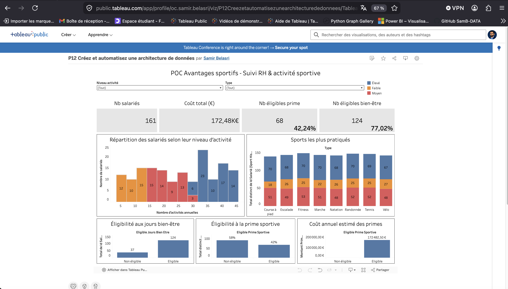

# POC Data Pipeline - Avantages sportifs

## 1. Contexte

Dans ce projet, j’ai réalisé un Proof of Concept (POC) d’un pipeline ETL permettant d’analyser l’impact de l’activité sportive des salariés sur des avantages RH.

L’objectif est de transformer des données brutes en indicateurs exploitables afin d’aider la prise de décision autour :

- des primes sportives
- des jours de bien-être
- de l’engagement des salariés
- du coût global des avantages RH

Ce projet simule une architecture data moderne combinant :
- traitement ETL
- orchestration
- base de données
- visualisation BI
- événements temps réel
- notifications collaboratives

---

# 2. Sources de données

Le projet repose sur deux sources principales.

## Données RH

Un fichier RH contenant notamment :

- identifiant salarié
- nom
- département
- salaire
- moyen de transport
- informations administratives

## Données sportives

Un historique d’activités sportives simulé avec Python et Faker :

- sport pratiqué
- distance parcourue
- durée de l’activité
- date de l’activité

Les données sont volontairement simulées afin de reproduire un cas métier réaliste dans un contexte POC.

---

# 3. Architecture du pipeline

Le pipeline suit une logique ETL complète.

## 1. Extract

### Chargement des données RH

Les données RH sont chargées dans PostgreSQL.

### Génération des activités sportives

Un script Python génère un historique d’activités sportives réaliste.

---

## 2. Transform

Les données sont nettoyées et enrichies :

- normalisation des formats
- contrôles qualité
- suppression des incohérences
- application des règles métier

### Règles métier appliquées

#### Prime sportive

La prime dépend :

- du mode de déplacement sportif
- du niveau d’activité
- de la régularité sportive

Le montant correspond à 5 % du salaire brut pour les salariés éligibles.

#### Jours bien-être

Des jours bien-être sont attribués selon le nombre d’activités sportives annuelles.

Un salarié devient éligible à partir de 15 activités annuelles.

---

## 3. Load

Les données transformées sont stockées dans la table finale :

employee_benefits

Cette table contient les indicateurs utilisés pour le reporting.

---

## 4. Export

Les données finales sont exportées au format CSV pour Tableau Public :

- employee_benefits.csv
- sport_history.csv

---

# 4. Architecture technique

Le pipeline repose sur l’architecture suivante :

Python ETL
↓
PostgreSQL
↓
Kestra (orchestration)
↓
Exports CSV
↓
Tableau Public

Une seconde chaîne événementielle temps réel a également été ajoutée :

Python Producer
↓
Redpanda / Kafka
↓
Python Consumer
↓
Slack API

Cette architecture permet de démontrer :

- un pipeline batch ETL
- une logique événementielle temps réel
- une orchestration technique
- une intégration collaborative

---

# 5. Stack technique

## Python

Utilisé pour :

- l’ETL
- les règles métier
- la génération des données
- les scripts Kafka
- les notifications Slack

Librairies principales :

- pandas
- faker
- kafka-python
- slack-sdk
- sqlalchemy

---

## PostgreSQL

Utilisé comme base de données relationnelle pour :

- stocker les données brutes
- stocker les données transformées
- centraliser les tables finales

---

## Docker

Utilisé pour conteneuriser :

- PostgreSQL
- Kestra
- Redpanda

Cela permet :

- la reproductibilité
- l’isolation des services
- le démarrage rapide de l’infrastructure

---

## Kestra

Utilisé pour orchestrer les workflows.

Le flow Kestra permet notamment de :

- vérifier l’état de la base PostgreSQL
- contrôler les tables générées
- superviser les exécutions

---

## Redpanda / Kafka

Utilisé pour simuler un pipeline temps réel événementiel.

Chaque activité sportive produit un événement Kafka consommé ensuite par un consumer Python.

---

## Slack API

Utilisé pour envoyer automatiquement des notifications dans un channel Slack.

Exemple :

🏃 Nouvelle activité sportive détectée

Employé : Samir Belasri
Sport : Course à pied
Distance : 8.4 km
Durée : 47 minutes

Bravo Samir Belasri ! 🔥🏅

---

## Tableau Public

Utilisé pour créer le dashboard final et visualiser les KPI RH et sportifs.

---

## GitHub

Utilisé pour :

- le versioning
- le partage du code
- la documentation technique

---

# 6. Dashboard Tableau

Le dashboard Tableau permet de visualiser :

- le nombre total de salariés
- le nombre d’éligibles
- le coût total des primes
- le taux d’éligibilité
- les sports les plus pratiqués
- les niveaux d’activité
- les avantages attribués

Des filtres interactifs permettent d’analyser :

- les types de sport
- les profils salariés
- les niveaux d’activité

---

## Lien du dashboard

https://public.tableau.com/views/P12Creezetautomatisezunearchitecturededonnees/Tableaudebord1?:language=fr-FR&:sid=&:redirect=auth&:display_count=n&:origin=viz_share_link

---

## Aperçu du dashboard

---

# 7. Intégration temps réel avec Redpanda et Slack

Le projet intègre une simulation temps réel basée sur Kafka / Redpanda.

## Fonctionnement

### Producer Python

Un producer envoie une activité sportive dans un topic Kafka.

### Redpanda

Redpanda joue le rôle de broker événementiel.

### Consumer Python

Le consumer récupère les événements puis :

- analyse l’activité
- construit un message métier
- envoie automatiquement une notification Slack

### Slack

Le message est envoyé dans le channel :

#sport-activities

---

# 8. Résultats obtenus

Le projet permet de :

- mesurer l’engagement sportif
- calculer les avantages RH
- analyser les coûts RH
- automatiser le traitement des données
- superviser l’exécution des flux
- démontrer une architecture data moderne

---

# 9. Limites du projet

Ce projet reste un POC.

Limites actuelles :

- données simulées via Faker
- orchestration Kestra simplifiée
- absence de CI/CD
- pas de Data Warehouse
- pas de monitoring avancé
- pas d’authentification centralisée

---

# 10. Améliorations possibles

Améliorations envisagées :

- connexion à une API sportive réelle (Strava)
- pipeline Kafka entièrement automatisé
- orchestration complète avec Kestra
- ajout de tests qualité automatisés
- monitoring temps réel
- déploiement cloud
- création d’une API métier
- historisation avancée des données
- dashboard Power BI professionnel

---

# 11. Lancement du projet

## Démarrage de l’infrastructure

docker compose up -d

---

## Chargement des données RH

python src/load/load_excel_to_postgres.py

---

## Génération des activités sportives

python src/extract/generate_sport_history.py

---

## Transformation métier

python src/transform/transform_business_rules.py

---

## Export Tableau

python src/load/export_for_tableau.py

---

## Producer Kafka

python src/slack/kafka_producer.py

---

## Consumer Kafka + Slack

python src/slack/kafka_consumer.py

---

# 12. Sécurité

Les informations sensibles sont externalisées dans un fichier :

.env

Ce fichier contient notamment :

- identifiants PostgreSQL
- token Slack
- variables d’environnement

Le fichier .env est exclu du versioning GitHub via .gitignore.

---

# 13. Structure du projet

src/
├── extract/
├── transform/
├── load/
├── slack/
├── orchestration/
├── quality/
└── utils/

reports/
└── tableau/

docs/

docker-compose.yml
README.md
requirements.txt

---

# 14. Liens du projet

## GitHub

https://github.com/SamB-DATA/wellness-sports-dashboard

## Dashboard Tableau

https://public.tableau.com/views/P12Creezetautomatisezunearchitecturededonnees/Tableaudebord1?:language=fr-FR&:sid=&:redirect=auth&:display_count=n&:origin=viz_share_link

---

# 15. Auteur

Projet réalisé par Samir Belasri dans le cadre du parcours Data Engineer.